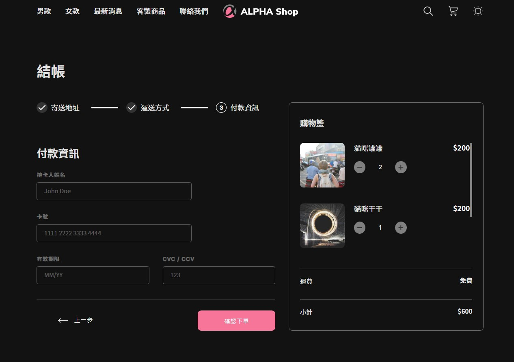

# ALPHA SHOP

## 功能
+ 點擊右上角的太陽/月亮圖標，可切換Dark mode
+ 於購物車點擊 + 與 - 鍵，可對項目數量進行增減，當數量小於 0 自動移除
+ 可使用結帳頁面下方按鈕，切換表單頁面
+ 螢幕寬大於750px時，預設展開navbar
+ 螢幕寬小於750px時，預設隱藏navbar

## Installing - 安裝流程
1. 打開終端機，Clone專案至本機
<pre><code>git clone https://github.com/Yuwen-ctw/ALPHA_Shop.git</code></pre>
2. 進入專案資料夾
<pre><code>cd ALPHA_Shop</code></pre>
3. 安裝npm套件
<pre><code>npm install</code></pre>
4. 啟動專案
<pre><code>npm start</code></pre>
5. 成功後會自動開啟網站，或點擊
http://localhost:3000 進入頁面。

 
 

